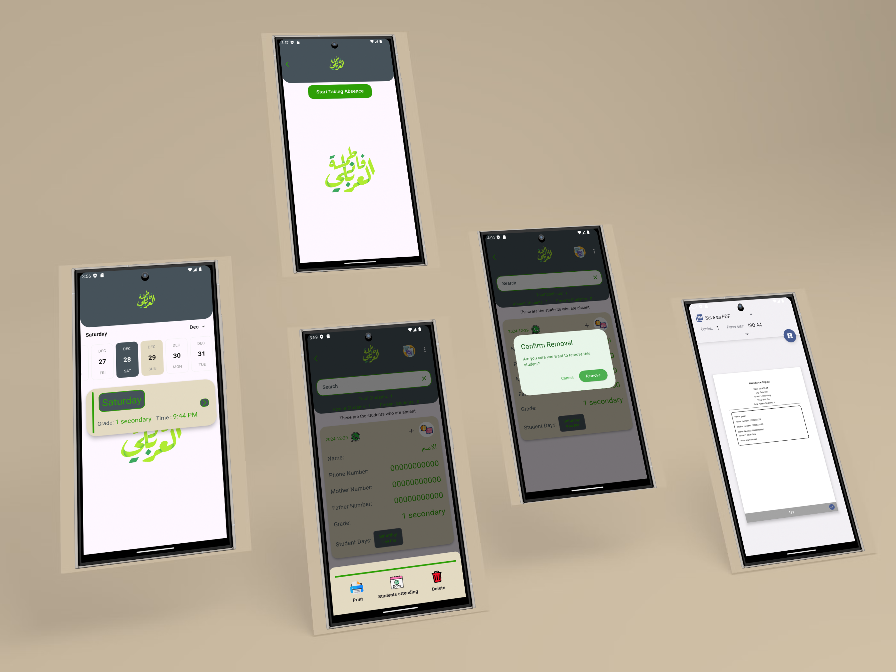

# Student Management System

## Overview
The **Student Management System** (SMS) is a software solution designed to help schools efficiently manage student information, attendance, grades, and communication with parents. The system provides administrators and teachers with an easy-to-use platform for registering students, tracking attendance, and generating reports.



## Features
- **Student Registration**: Add and manage student profiles with personal, academic, and contact details.
- **Attendance Tracking**: Record attendance for each class or day, including reasons for absences.
- **Grade Management**: Input and track student grades and generate performance reports.
- **Group Management**: Organize students into groups or classes for easier management.
- **Reports**: Generate attendance and grade reports for analysis.
- **Communication**: Keep parents and guardians informed through notifications.
- **Secure Access**: Role-based user authentication for secure access to student data.

## Installation

1. **Clone the repository**:
    ```bash
    git clone https://github.com/yourusername/student-management-system.git
    cd student-management-system
    ```

2. **Install dependencies**:
    - If you're using Flutter, run the following command to install the necessary packages:
      ```bash
      flutter pub get
      ```

3. **Run the application**:
    - To start the app on an emulator or connected device, use:
      ```bash
      flutter run
      ```

## Configuration

- Set up your Firebase project for backend support (authentication, Firestore, etc.).
- Update the Firebase configuration in `lib/firebase_config.dart` with your Firebase project details.

## Technologies Used
- **Flutter**: For building the mobile application.
- **Firebase**: For backend services, including authentication and data storage.
- **Dart**: For the programming language.
  
## Contributing
- Fork the repository, make your changes, and create a pull request.

## License
This project is licensed under the MIT License.


